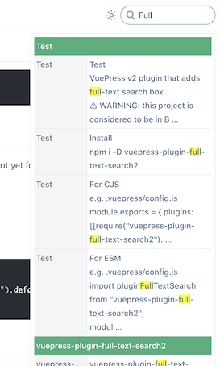

# vuepress-plugin-full-text-search2

[VuePress v2] plugin that adds full-text search box.



[vuepress v2]: https://v2.vuepress.vuejs.org/

:warning: WARNING: this project is considered to be in BETA until [VuePress v2] is available for general use and the API is stable!

## Usage

```shell
npm i -D vuepress-plugin-full-text-search2
```

e.g. `.vuepress/config.js`

```js
import fullTextSearchPlugin from "vuepress-plugin-full-text-search2";
module.exports = {
  plugins: [fullTextSearchPlugin],
};
```

## Options

### locales

- Type: `Record<string, { placeholder: string }>`

- Details:

  The text of the search box in different locales.

  If this option is not specified, it will fallback to default text.

- Example:

```ts
import fullTextSearchPlugin from "vuepress-plugin-full-text-search2";
export default {
  plugins: [
    fullTextSearchPlugin({
      locales: {
        '/': {
          placeholder: 'Search',
        },
        '/zh/': {
          placeholder: '搜索',
        },
      },
    }),
  ],
}
```

- Also see:
  - [VuePress v2 - Guide > I18n]([../../guide/i18n.md](https://v2.vuepress.vuejs.org/guide/i18n.html))
